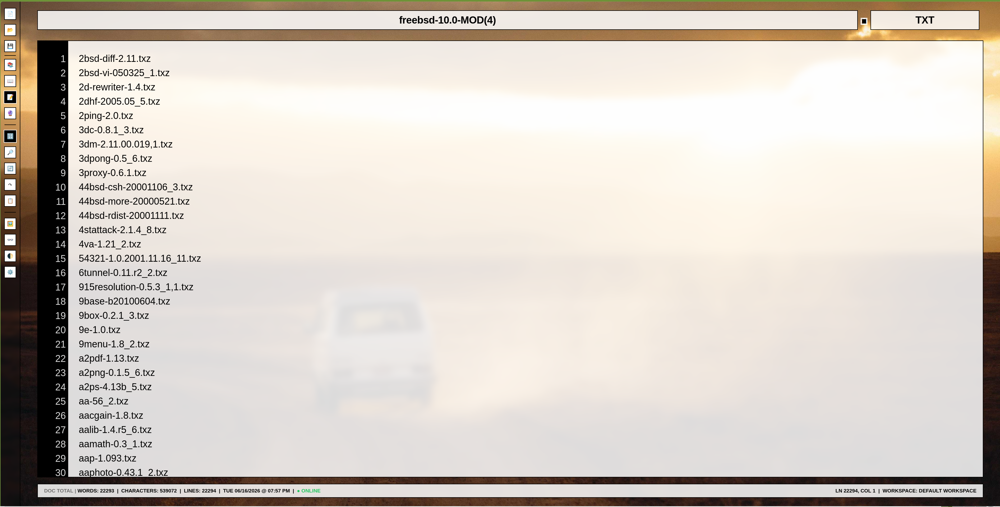
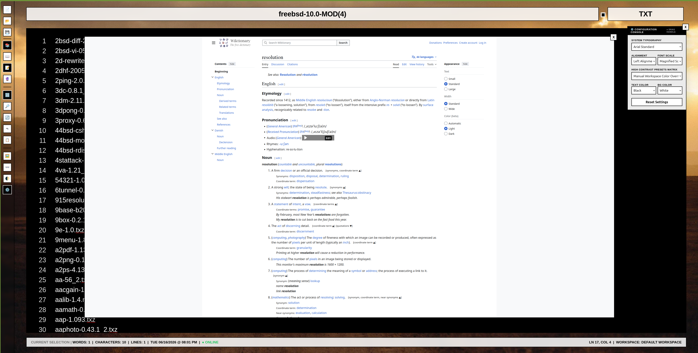

# 📝 ProText Workspace

A lightweight, portable, browser-based text editing environment designed for distraction-free writing, workspace personalization, and document portability.

ProText combines the simplicity of traditional plain-text editing with workspace-aware document packages, allowing users to save both their content and complete editor environment inside a single portable file.

---

## ✨ Features

### 📄 Plain Text Editing

* Fast, lightweight text editing
* Real-time line numbering
* Live character and document telemetry
* Automatic document title management
* Extension-aware document naming

### 🎨 Workspace Customization

* Multiple built-in color schemes
* Fully customizable foreground and background colors
* Adjustable transparency levels
* Dynamic typography controls
* Font family selection
* Text alignment controls
* Font scaling controls

### 🖼️ Wallpaper Environment System

* Custom wallpaper management
* Persistent wallpaper registry
* Active wallpaper selection
* Workspace restoration between sessions
* Portable wallpaper configuration storage

### 💾 Environment Manifest Technology

ProText supports embedded workspace manifests.

Users may save documents as:

#### Standard Document

Contains only the document contents.

```text
Hello World
```

#### Workspace Package

Contains both document contents and the complete editor environment.

```text
Document Content...

===================================================

ProText Environment Manifest

TITLE=Notes
FONT=Arial
SCHEME=custom
FGCOLOR=white
BGCOLOR=black

===================================================
```

When reopened, ProText automatically restores:

* Theme selection
* Custom colors
* Font settings
* Alignment preferences
* Wallpaper configuration
* Opacity settings
* Workspace state

---

## 🚀 Why ProText?

Traditional text editors store only content.

ProText stores:

* Content
* Appearance
* Workspace configuration
* Personal environment preferences

This allows documents to be moved between systems while preserving the original editing experience.

---

## 🏗️ Architecture

ProText is implemented as a self-contained browser application using:

* HTML5
* CSS3
* Vanilla JavaScript
* LocalStorage persistence
* Custom manifest serialization

No external frameworks are required.

---

## 🔧 Core Components

### Document Engine

Handles:

* File loading
* File saving
* Workspace package serialization
* Manifest parsing

### Theme Engine

Responsible for:

* Color schemes
* Custom palettes
* Opacity controls
* Dynamic CSS variable management

### Typography Engine

Responsible for:

* Font selection
* Font scaling
* Alignment controls
* Workspace-wide typography updates

### Environment Engine

Responsible for:

* Wallpaper registry management
* Active wallpaper selection
* Workspace restoration
* Session persistence

---

## 📂 Saving Documents

Users may choose between:

### Save Document Only

Saves only the text content.

### Save Document + Workspace

Saves:

* Content
* Theme
* Colors
* Typography
* Wallpapers
* Opacity settings
* Environment preferences

into a single portable package.

---

## 📸 Screenshots

### Main Workspace



### Dictionary


### Thesaurus



---

## 🛣️ Planned Features

* Rich text formatting
* Search and replace
* Export templates
* Session snapshots
* Theme import/export
* Markdown support
* Workspace profiles
* Plugin architecture

---

## 📜 License

This project is released under the MIT License.

---

## 👨‍💻 Author

**Khwaja Mahad Haq**

Master of Science in Computer Science

Focused on:

* Linux Systems Administration
* Automation Engineering
* Full Stack Development
* Monitoring & Observability Platforms
* Developer Productivity Tools

GitHub: https://github.com/kmahadh 
